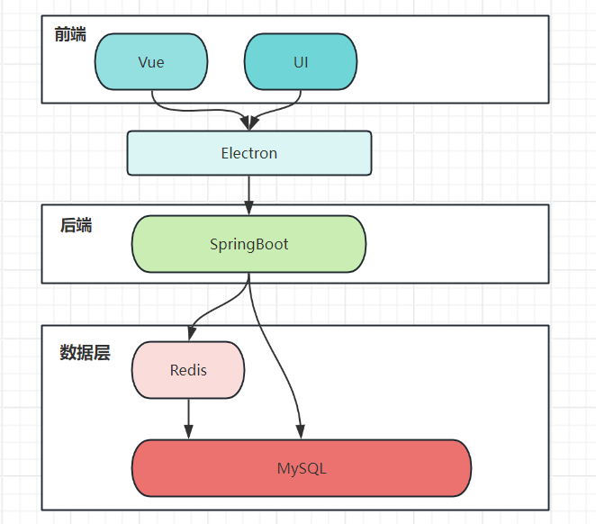

# SwiftTickets

## 一、项目的基本介绍

12306 铁路购票服务是与大家生活和出行相关的关键系统，包括会员、购票、订单、支付和网关等服务。

SwiftTickets是一个仿12306的高并发铁路票务系统。

## 二、项目使用的基本架构



## 三、项目具体实现

### 前端页面 

依赖 `nodejs`、`vite`

```shell
npm init vite
	->y
	->[project_name]
	->Vue
	->JavaScript
cd [project_name]
npm install 
npm run dev 
```

只要运行的话 `npm run dev` 就行了

### 登录功能

简化了User，只有username， phone，id三个字段，以phone为key。

实现功能：

验证码登录，有效期，token，登出

### 查询火车班次

发送数据：

```json
{
    "fromStation": "北京南",
    "toStation": "杭州东",
    "departureDate": "2024-05-05"
}
```

返回数据

```json
{
    "success": true,
    "data": [
        {
            "path": "北京南,济南西,南京南,杭州东,宁波",
            "trainname": "G1000",
            "starttime": "2024-05-05 06:00:00.0",
            "endtime": "2024-05-05 10:00:00.0",
            "timetable": "0,60,120,180,240"
        },
        {
            "path": "北京南,济南西,南京南,杭州东,宁波",
            "trainname": "G2000",
            "starttime": "2024-05-05 08:00:00.0",
            "endtime": "2024-05-05 12:00:00.0",
            "timetable": "0,60,120,180,240"
        },
        {
            "path": "北京南,济南西,南京南,杭州东,宁波",
            "trainname": "G3000",
            "starttime": "2024-05-05 10:00:00.0",
            "endtime": "2024-05-05 14:00:00.0",
            "timetable": "0,60,120,180,240"
        },
        {
            "path": "北京南,济南西,南京南,杭州东,宁波",
            "trainname": "G4000",
            "starttime": "2024-05-05 12:00:00.0",
            "endtime": "2024-05-05 16:00:00.0",
            "timetable": "0,60,120,180,240"
        }
    ]
}
```

### 售票业务逻辑

因为现实中的火车票过于复杂，所以简化这个场景，做出以下假设：

- 所有火车只有一条线路。
- 每班火车有100个座位。
- 每天的排班相同并且暂时不涉及跨天。


售票逻辑：

在查询火车班次获得班次数据后：


余票数据存储在Redis中，并且有效期在班次结束前。

一列班次在Redis中的数据结构如下：

HashMap：

​		key：trainname + date

​		value：

​				field：atomicroute  

​				value：余票数

查询是否有余票的步骤为：

- （MySQL）根据fromStation和toStation在表t_path中获取子路段；也可以根据search返回的routeList中的path截取得到。
- （Java）根据子路段得到原子路段的列表。
- （Redis）遍历原子路段列表，所有原子路段余票均大于0则代表有余票。

其中，Redis中的票务信息是Route在创建的时候同时添加到Redis中去的，有效期在班次结束售票前有效。
